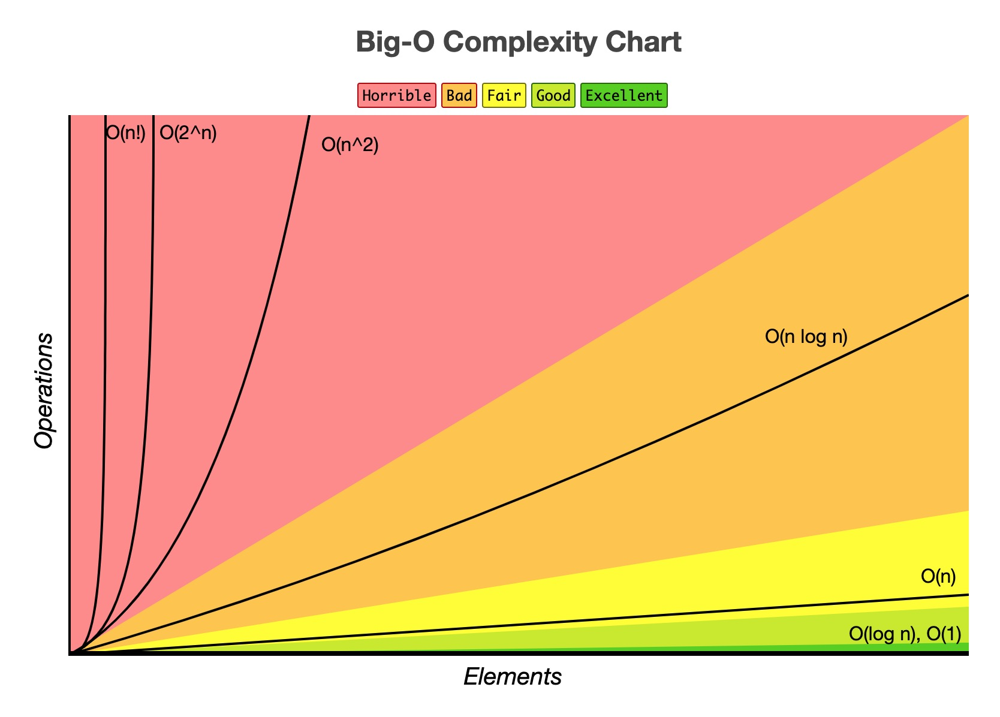

La complejidad del tiempo de ejecución de un algoritmo, entre otras cosas, describe el desempeño del mismo. En concreto, nos puede indicar qué tanto mas poder de procesamiento o tiempo es requerido para ejecutar determinado algoritmo si se incrementan los datos de entrada.

La notación **Big O** (u O mayúscula) es el lenguaje y la métrica utilizada para describir la eficiencia de un algoritmo.

## Diferencia entre **Big O**, **Big Θ**(Theta) y **Big Ω**(Omega)

- **O**: Describe un límite superior en tiempo de ejecución. Por ejemplo, si un algoritmo imprime todos los valores de un arreglo, su complejidad será **O(N)**, pero también podría ser **O(N<sup>2</sup>)**, **O(N<sup>3</sup>)**, **O(2<sup>N</sup>)** o cualquier otro tiempo **O** que sea más lento que **O(N)**.
- **Ω**: Describe un límite inferior en tiempo de ejecución. Por ejemplo, imprimir los valores de un arreglo es **Ω(n)** pero también podría ser **Ω(N log(N))**, **Ω(log(N))** u **Ω(1)**, pero no podría ser más rápido que esos tiempos de ejecución.
- **Θ**: Describe ambos tiempos de ejecución **O** y **Ω**. Esto implica que un algoritmo es **Θ(N)** si es **O(N)** y **Ω(N)**.


## Mejor, peor y caso esperado

No existe una relación directa entre el mejor, peor y el caso esperado de un algoritmo y las notaciones O, Ω y Θ.

- El mejor, peor y caso esperado describen el tiempo de ejecición O (ó Θ) para determinados casos o valores de entrada.

- O, Ω y Θ describen los límites superior, inferior y estrechos (ambos superior e inferior) para determinado tiempo de ejecución.

## Eliminar constantes

Es posible que un algoritmo O(N) se ejecute más rápido que uno O(1) para determinados valores de entrada. Por esta razón se ignoran las constantes al momento de describir el tiempo de ejecución. Así pues, un algoritmo descrito como O(2N) es un algoritmo O(N).

- O(N<sup>2</sup> + N) se convierte en O(N<sup>2</sup>)
- O(N + log(N)) se convierte en O(N)
- O(5 * 2<sup>N</sup> + 1000N<sup>1000</sup>) se convierte en O(2<sup>N</sup>)

## Cómo calcular el tiempo de ejecución de un algoritmo

### Para algoritmos multiparte
Se suman los tiempos de ejecución: `O(A + B)`

```
for (int a: arr A) {
  print(a);
}
for (int b: arr B) {
  print(b);
}
```

### Sumar vs Multiplicar

Multiplicar los tiempos de ejecución: `O(A * B)`

```
for (int a: arr A) {
  for (int b: arr B) {
    print(a + ", " + b);
  }
}
```

#### Lineal

Para el [problema de invertir una cadena](https://notas.uristolar.com/ejercicios-algoritmos#reverse-string), una posible solución iterativa es:

```javascript
function invertir(cadena) {
  let invertida = ''

  for (let caracter of cadena) {
    invertida = caracter + invertida
  }

  return invertida
}
```

En esta solución iteramos cada caracter de la cadena que queremos invertir __una sola vez__, es decir, si la cadena es `abc` iteramos dicha cadena `3` veces. Por cada caracter que le agreguemos a la cadena se generará una iteración mas en el bucle `for`. Esto significa que el tiempo de ejecución sería **O(n)** o *lineal*.

#### Cuadrático

Para el problema de [steps (o media pirámide)](https://notas.uristolar.com/ejercicios-algoritmos#steps) y su solución con dos bucles for (uno anidado):

```javascript
const steps = n => {
  let row = 0
  let col = 0

  for (row; row < n; row++) {
    let result = ''
    for (col; col < n; col++) {
      if (col <= row) result += '#'
      else result += ' '
    }
    console.log(result)
  }
}
```

En este caso, para cada valor de entrada `n` tenemos dos for que iteran n veces; esto significa que cada vez que se incremente el valor de `n` se va a incrementar de manera cuadrática el número de instrucciones a ejecutar: si `n = 2` habrá que realizar 4 instrucciones, si `n = 3` habrá que realizar 9 instrucciones y así sucesivamente, lo que nos indica que el tiempo de ejecución es **O(n<sup>2</sup>)**.

En resumen:

| Trabajo                  | Complejidad |
| :---------------------------|:-----|
| Iterar una sola colección de datos mediante un bucle for | Probablemente O(N) |
| Iterar media colección de datos | O(N) |
| Iterar dos colecciones de datos diferentes con bucles for separados | O(N + M) |
| Dos bucles for anidados iterando la misma colección | O(N<sup>2</sup>) |
| Ordenamiento | Probablemente O(N*log(N)) |
| Búsqueda sobre un arreglo ordenado | O(log(N)) |

A continuación se muestra una tabla con algunas de las complejidades algorítmicas más comunes y qué tan eficientes son:

