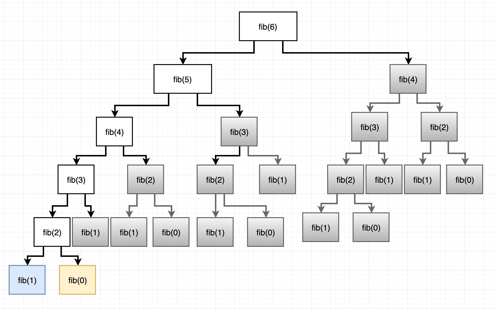

Partiendo del [problema de calcular el n-ésimo elemento de la serie de Fibonacci](https://notas.uristolar.com/ejercicios-algoritmos#fibonacci) podemos obtener la muy conocida solución recursiva:

```
function fib (n) {
  if (n < 2) return n
  return fib(n - 1) + fib(n - 2)
}
```

Dicha solución tiene una [complejidad algorítmica](https://notas.uristolar.com/complejidad-algoritmica) de **O(2<sup>n</sup>)** lo cual no es eficiente en absoluto. Esto se debe a que cada invocación a la función fibonacci recursiva mayor a 1 genera muchas mas llamadas a dicha función hasta llegar a la llamada con argumento 1 ó 0. Podemos observar un ejemplo de la llamada a la función recursiva fibonacci con `n = 6`:



Una forma para mejorar el tiempo de ejecución de este algoritmo (y de muchos otros) es utilizando la técnica llamada [Memoization](https://en.wikipedia.org/wiki/Memoization) la cual, de manera general, consiste en almacenar en una memoria caché los resultados computacionalmente costosos de llamadas a funciones y retornarlos cuando sean requeridos por la llamada a la función _con los mismos argumentos de entrada_.

En el caso de la imagen anterior, sólo se calcularían los resultados con un fondo blanco y se almacenarían en caché todos los resultados con fondo gris, reduciendo drásticamente el tiempo de ejecución del algoritmo recursivo antes mencionado.

Para implementar esta técnica en el problema de Fibonacci recursivo mencionado anteriormente, haremos lo siguiente:

1. Pasar nuestra función fibonacci recursiva a la función `memoize`
2. La función `memoize` almacenará los resultados de la función fibonacci en una memoria
3. La próxima vez que se invoque la función fibonacci, la función `memoize` consultará en su memoria los resultados obtenidos anteriormente:
      - Si ya existe dicho resultado, se retornará automáticamente
      - Si no existe, se computará el resultado, se almacenará en la memoria y se retornará su valor

La implementación en JavaScript es la siguiente:

```
function fib (n) {
  if (n < 2) return n
  return fib(n - 1) + fib(n - 2)
}

function memoize (fn) {
  const cache = {}
  return function(...args) {
    if (cache[args]) return cache[args]

    const result = fn.apply(this, args)
    cache[args] = result
    return result
  }
}

fib = memoize(fib)

console.log(fib(15))
```

Adicional a lo ya mencionado:

- Se utiliza el método [apply()](https://developer.mozilla.org/en-US/docs/Web/JavaScript/Reference/Global_Objects/Function/apply) para llamar a la función `fn` (que finalmente es la función `fib`) con un valor `this` determinado y los `argumentos` originales (el valor de `n`).
- Reasignamos `fib` a la función "memoizada" de fib con objeto de que las llamadas recursivas generadas en la función original fib hagan referencia a la versión "memoizada" de fib recursivo.